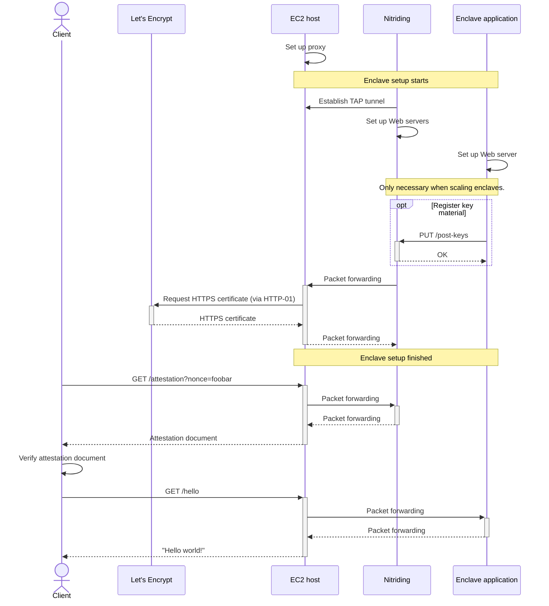

```mermaid
sequenceDiagram
  actor client as Client
  participant ca as Let's Encrypt
  participant ec2 as EC2 host
  participant nitriding as Nitriding
  participant app as Enclave application

ec2->>ec2: Set up proxy

Note over ec2,app: Enclave setup starts

nitriding->>ec2: Establish TAP tunnel
nitriding->>nitriding: Set up Web servers
app->>app: Set up Web server

Note over nitriding,app: Only necessary when scaling enclaves.

opt Register key material
  app->>+nitriding: PUT /post-keys
  nitriding-->>-app: OK
end

nitriding->>+ec2: Packet forwarding
ec2->>+ca: Request HTTPS certificate (via HTTP-01)
ca-->>-ec2: HTTPS certificate
ec2-->>-nitriding: Packet forwarding

Note over ec2,app: Enclave setup finished

client->>+ec2: GET /attestation?nonce=foobar
ec2->>+nitriding: Packet forwarding
nitriding-->>-ec2: Packet forwarding
ec2-->>-client: Attestation document

client->>client: Verify attestation document

client->>+ec2: GET /hello
ec2->>+app: Packet forwarding
app-->>-ec2: Packet forwarding
ec2-->>-client: "Hello world!"
```
