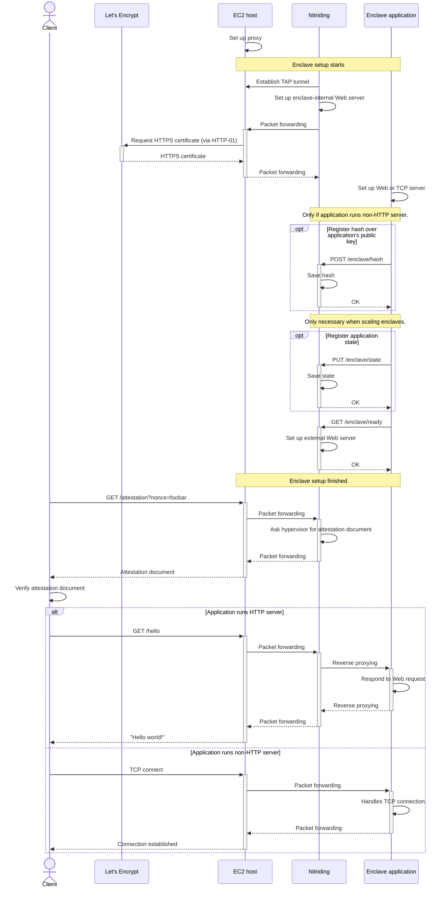

```mermaid
sequenceDiagram
  actor client as Client
  participant ca as Let's Encrypt
  participant ec2 as EC2 host
  participant nitriding as Nitriding
  participant app as Enclave application

ec2->>ec2: Set up proxy

Note over ec2,app: Enclave setup starts

nitriding->>ec2: Establish TAP tunnel
nitriding->>nitriding: Set up enclave-internal Web server

nitriding->>+ec2: Packet forwarding
ec2->>+ca: Request HTTPS certificate (via HTTP-01)
ca-->>-ec2: HTTPS certificate
ec2-->>-nitriding: Packet forwarding

app->>app: Set up Web or TCP server

Note over nitriding,app: Only if application runs non-HTTP server.

opt Register hash over application's public key
  app->>+nitriding: POST /enclave/hash
  nitriding->>nitriding: Save hash
  nitriding-->>-app: OK
end

Note over nitriding,app: Only necessary when scaling enclaves.

opt Register application state
  app->>+nitriding: PUT /enclave/state
  nitriding->>nitriding: Save state
  nitriding-->>-app: OK
end

app->>+nitriding: GET /enclave/ready
nitriding->>nitriding: Set up external Web server
nitriding-->>-app: OK

Note over ec2,app: Enclave setup finished

client->>+ec2: GET /attestation?nonce=foobar
ec2->>+nitriding: Packet forwarding
nitriding->>nitriding: Ask hypervisor for attestation document
nitriding-->>-ec2: Packet forwarding
ec2-->>-client: Attestation document

client->>client: Verify attestation document

alt Application runs HTTP server
  client->>+ec2: GET /hello
  ec2->>+nitriding: Packet forwarding
  nitriding->>+app: Reverse proxying
  app->>app: Respond to Web request
  app-->>-nitriding: Reverse proxying
  nitriding-->>-ec2: Packet forwarding
  ec2-->>-client: "Hello world!"
else Application runs non-HTTP server
  client->>+ec2: TCP connect
  ec2->>+app: Packet forwarding
  app->>app: Handles TCP connection
  app-->>-ec2: Packet forwarding
  ec2-->>-client: Connection established
end
```
