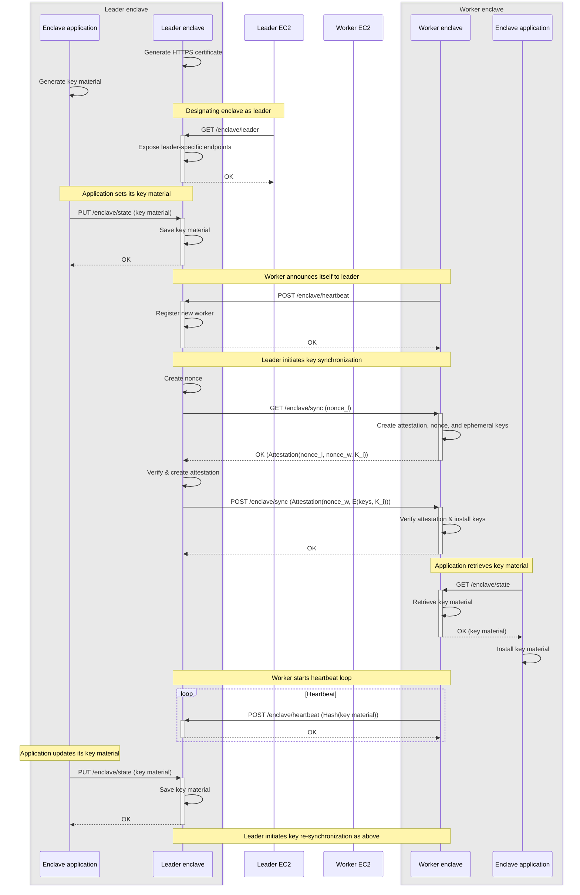

# Enclave key synchronization

Nitriding supports horizontal scaling, i.e., it allows for the synchronization
of key material among enclaves.  Key material consists of both nitriding and
application keys:

1. Nitriding's key material is the self-signed HTTPS certificate (both public
   and private key) that provides the confidential channel between clients and
   the enclave.
2. The application's key material is application-specific.  Nitriding is
   agnostic to the structure of this key material and treats it as arbitrary
   bytes.

For enclave key synchronization to work, there must be a single leader
enclave and one or more worker enclaves.  The leader enclave's sole job is to
create key material and make itself available to synchronize this key material
with worker enclaves.

To enable horizontal scaling, use the `-fqdn-leader` command line flag.

